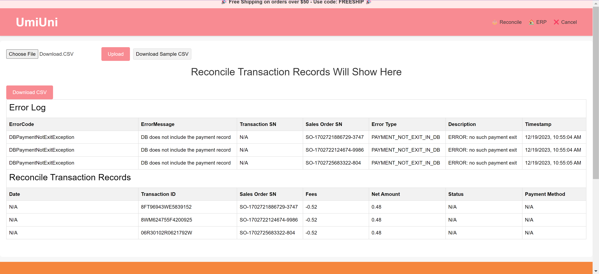
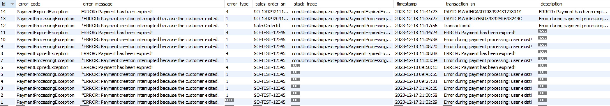

# Umi-shop-backend
1. PayPal: https://developer.paypal.com/braintree/docs/guides/ec-braintree-sdk/server-side/java
2. https://developer.paypal.com/docs/api/partner-referrals/v2/
3. https://chat.openai.com/share/1d431841-65cc-4937-98d3-2540b637d1ff [Payment-RollBack realted]

# create Reconcile Log_ERROR_DB


# create payment Log_ERROR_DB
create payment Log_ERROR_DB to save every error/interrupts occur during payment process.



# Redis
有几种优化策略可以提高电商网站加载商品主页的效率，并减少对数据库的重复访问。以下是一些推荐的做法：

1. **缓存（Caching）**:
   - **应用层缓存**：可以在应用层面引入缓存机制，比如使用Redis或Memcached来存储热门商品的信息。这样，用户在访问商品主页时，系统首先从缓存中检索数据，如果未命中，则读取数据库并更新缓存。这将大大减少数据库的访问次数。
   - **CDN缓存**：使用内容分发网络（CDN）缓存静态资源，如商品图片、CSS和JavaScript文件，可以加快全球用户的加载速度。

2. **数据库优化**:
   - **查询优化**：确保数据库查询是高效的，比如通过合理的索引、避免全表扫描等。
   - **读写分离**：将数据库的读操作和写操作分离，使用主从复制技术，可以提高数据库的并发处理能力。

3. **按需加载/懒加载（Lazy Loading）**:
   - 对于商品列表，可以实现按需加载，即仅当用户滚动查看更多商品时才加载更多内容，而不是一次性加载所有商品。

4. **前端优化**:
   - 通过减少HTTP请求、压缩文件、合理使用HTTP缓存控制策略等方式来优化前端性能。
   - 实现异步加载（AJAX）来更新页面内容，无需重新加载整个页面。

5. **使用负载均衡**:
   - 如果网站流量较大，可以考虑使用负载均衡器分散请求到多个服务器，从而提高整体的处理能力和可用性。

6. **微服务架构**:
   - 如果您的应用非常庞大且复杂，可以考虑将其拆分为多个微服务，每个服务负责处理特定的功能。这样可以提高每个服务的专注度和效率。

通过综合应用上述策略，可以显著提高您电商网站的性能和用户体验。每种方法都有其适用场景，建议根据您的具体需求和资源情况进行选择和调整。如果需要更详细的实现建议或帮助，请随时提问！

# Customer, Supplier 在加了身份验证 改了代码以后没有办法登录（用户名密码都没有问题）
因为password Encoder在JWTProvide里面需要处理各种用户密码登录操作的password；如果把Password Encoder和其他函数放在了JWTFilter或其他地方就会报错

# add TransactionTemplate to payment process for payment rollback
 If you are facing difficulties using `TransactionSynchronizationManager` and it's not resolving the `getCurrentTransactionStatus` method, here's an alternative approach to handle transaction rollback programmatically:

1. **Using `TransactionStatus` Parameter**:

   You can modify your method signature to include a `TransactionStatus` parameter, which allows you to control the transaction programmatically. Here's an updated version of your `createPayment` method:

   ```java
   import org.springframework.transaction.annotation.Transactional;
   import org.springframework.transaction.annotation.Isolation;
   import org.springframework.transaction.TransactionStatus;
   import org.springframework.transaction.support.TransactionCallbackWithoutResult;
   import org.springframework.transaction.support.TransactionTemplate;
   import org.springframework.beans.factory.annotation.Autowired;

   @Service
   public class PayPalPaymentServiceImpl implements PayPalPaymentService {

       @Autowired
       private TransactionTemplate transactionTemplate; // Inject the TransactionTemplate

       @Override
       @Transactional(rollbackFor = Exception.class, isolation = Isolation.READ_COMMITTED)
       public PayPalPaymentResponse createPayment(SalesOrder salesOrder, TransactionStatus status) {
           try {
               Payment createdPayment = payment.create(getAPIContext());
               log.info("createPayment: " + createdPayment);

               // Find the approval URL
               String approvalUrl = createdPayment.getLinks().stream()
                       .filter(link -> "approval_url".equalsIgnoreCase(link.getRel()))
                       .findFirst()
                       .map(link -> link.getHref())
                       .orElse(null);
               log.info("approval_url: " + approvalUrl);

               PayPalPaymentResponse response = new PayPalPaymentResponse("success create payment!", createdPayment.getId(), approvalUrl);
               log.info("create response: " + response);

               return response;
           } catch (PayPalRESTException e) {
               e.printStackTrace();
               // Handle PayPal API exceptions
               log.error("Error creating payment: " + e.getMessage(), e);

               // Mark the transaction for rollback programmatically
               status.setRollbackOnly();

               return new PayPalPaymentResponse("Failed to create payment", null, null);
           } catch (Exception ex) {
               // Handle other unexpected exceptions
               log.error("Unexpected error creating payment: " + ex.getMessage(), ex);

               // Mark the transaction for rollback programmatically
               status.setRollbackOnly();

               // You can also rollback the payment or take other appropriate actions here
               return new PayPalPaymentResponse("Unexpected error", null, null);
           }
       }
   }
   ```

   In this updated code, we added a `TransactionStatus` parameter named `status` to the `createPayment` method. We use `status.setRollbackOnly()` to programmatically mark the transaction for rollback when an exception occurs.

2. **Wrap Transaction with `TransactionTemplate`**:

   Another approach is to wrap your transactional code with a `TransactionTemplate`. Here's how you can do it:

   ```java
   import org.springframework.stereotype.Service;
   import org.springframework.transaction.annotation.Transactional;
   import org.springframework.transaction.annotation.Isolation;
   import org.springframework.transaction.support.TransactionTemplate;
   import org.springframework.beans.factory.annotation.Autowired;

   @Service
   public class PayPalPaymentServiceImpl implements PayPalPaymentService {

       @Autowired
       private TransactionTemplate transactionTemplate; // Inject the TransactionTemplate

       @Override
       public PayPalPaymentResponse createPayment(SalesOrder salesOrder) {
           // Use TransactionTemplate to manage the transaction
           return transactionTemplate.execute(status -> {
               try {
                   Payment createdPayment = payment.create(getAPIContext());
                   log.info("createPayment: " + createdPayment);

                   // Find the approval URL
                   String approvalUrl = createdPayment.getLinks().stream()
                           .filter(link -> "approval_url".equalsIgnoreCase(link.getRel()))
                           .findFirst()
                           .map(link -> link.getHref())
                           .orElse(null);
                   log.info("approval_url: " + approvalUrl);

                   PayPalPaymentResponse response = new PayPalPaymentResponse("success create payment!", createdPayment.getId(), approvalUrl);
                   log.info("create response: " + response);

                   return response;
               } catch (PayPalRESTException e) {
                   e.printStackTrace();
                   // Handle PayPal API exceptions
                   log.error("Error creating payment: " + e.getMessage(), e);

                   // Mark the transaction for rollback programmatically
                   status.setRollbackOnly();

                   return new PayPalPaymentResponse("Failed to create payment", null, null);
               } catch (Exception ex) {
                   // Handle other unexpected exceptions
                   log.error("Unexpected error creating payment: " + ex.getMessage(), ex);

                   // Mark the transaction for rollback programmatically
                   status.setRollbackOnly();

                   // You can also rollback the payment or take other appropriate actions here
                   return new PayPalPaymentResponse("Unexpected error", null, null);
               }
           });
       }
   }
   ```

   In this approach, we use the `transactionTemplate.execute` method to manage the transaction and ensure proper rollback handling. This may be a cleaner way to handle transactions in your Spring application.

Please choose the approach that best suits your application's architecture and requirements. Ensure that you have the necessary Spring configuration in place for transaction management to work correctly.


# CompareTo()
The error message "Operator '<' cannot be applied to 'java.math.BigDecimal', 'double'" occurs because you are trying to compare a `BigDecimal` with a primitive `double` using the less-than (`<`) operator. In Java, you cannot directly use the `<` operator to compare a `BigDecimal` and a `double` because they are of different data types.

To compare a `BigDecimal` with a `double`, you should convert the `BigDecimal` to a `double` or the `double` to a `BigDecimal` before performing the comparison. Here's how you can do it:

1. Convert `BigDecimal` to `double`:
```
   BigDecimal bigDecimalValue = /* your BigDecimal value */;
   double doubleValue = bigDecimalValue.doubleValue();
   
   if (doubleValue < someDoubleValue) {
       // Perform your logic
   }
```

2. Convert `double` to `BigDecimal`:
```
   BigDecimal bigDecimalValue = BigDecimal.valueOf(someDoubleValue);
   BigDecimal otherBigDecimalValue = /* another BigDecimal value */;
   
   if (bigDecimalValue.compareTo(otherBigDecimalValue) < 0) {
       // Perform your logic
   }
```

Choose the appropriate approach based on your specific use case. The first approach is suitable if you want to compare a `BigDecimal` with a `double`, while the second approach is suitable if you want to compare two `BigDecimal` values.

## compareTo()
you cannot directly use the `<` operator to compare two `BigDecimal` objects because `BigDecimal` is an arbitrary-precision decimal data type, and direct comparison with `<` or `>` is not supported.

To compare two `BigDecimal` objects, you should use the `compareTo` method. Here's how you can do it:

```
BigDecimal value1 = /* your first BigDecimal value */;
BigDecimal value2 = /* your second BigDecimal value */;

int comparisonResult = value1.compareTo(value2);

if (comparisonResult < 0) {
    // value1 is less than value2
    // Perform your logic here
} else if (comparisonResult > 0) {
    // value1 is greater than value2
    // Perform your logic here
} else {
    // value1 is equal to value2
    // Perform your logic here
}
```

In the code above:

- `compareTo` returns a negative value if `value1` is less than `value2`, a positive value if `value1` is greater than `value2`, and zero if they are equal.

- Based on the result of the `compareTo` method, you can perform the appropriate logic to handle the comparison between the two `BigDecimal` objects.

# Customer Exist Payment 1
To handle the situation where the user closes the webpage and exits the payment process without completing it, you can introduce a mechanism to detect such exits and notify your application. Here's how you can do it:

1. **Frontend Detection**: You can use JavaScript on your frontend to detect when the user closes the browser window or navigates away from the page. When such an event occurs, you can send an HTTP request to your backend to notify it of the exit.

2. **Backend Handling**: On the backend, you can receive the notification and log the event, which will allow developers to be informed of the exit. You can also add additional logic, such as sending an email notification to relevant parties.

Here's an example of how you can implement this:

On the Frontend (JavaScript):
```javascript
// JavaScript code to detect page unload or browser close event
window.addEventListener('beforeunload', function (e) {
    // Send an HTTP request to your backend to notify of the exit
    fetch('/notify-exit', {
        method: 'POST',
        headers: {
            'Content-Type': 'application/json',
        },
        body: JSON.stringify({ exitReason: 'User closed the browser' }),
    });
});
```

On the Backend (Spring Boot Controller):
```java
@RestController
public class PayPalPaymentController {

    @PostMapping("/notify-exit")
    public ResponseEntity<String> notifyExit(@RequestBody ExitNotification exitNotification) {
        // Log the exit event with a timestamp
        String exitReason = exitNotification.getExitReason();
        LocalDateTime exitTime = LocalDateTime.now();
        log.info("User exited the payment process. Reason: {}. Timestamp: {}", exitReason, exitTime);

        // You can add further actions here, such as sending email notifications to developers

        return ResponseEntity.ok("Exit notification received.");
    }
}

// ExitNotification class for deserializing the JSON request body
public class ExitNotification {
    private String exitReason;

    public String getExitReason() {
        return exitReason;
    }

    public void setExitReason(String exitReason) {
        this.exitReason = exitReason;
    }
}
```

In this example:

- The frontend JavaScript code listens for the `beforeunload` event, which is triggered when the user closes the browser or navigates away from the page.
- When the event is detected, it sends an HTTP POST request to the `/notify-exit` endpoint on the backend.
- The Spring Boot controller handles the `/notify-exit` endpoint, logs the exit event, and performs any additional actions you require.

This way, you can track and log instances where users exit the payment process prematurely, and you can customize the handling of such events according to your application's needs, such as notifying developers or taking other appropriate actions.

Certainly! The `customerExitsDuringPayment()` method is a placeholder for a condition that you would need to implement to detect if the customer exits the payment process. This condition should be based on your application's specific requirements and logic. It would typically involve checking some user interaction or session state to determine if the user exited during payment.

Here's an example of how you might implement such a method:

```java
@Service
public class PayPalPaymentServiceImpl implements PayPalPaymentService {

    // Other methods...

    // Placeholder for checking if the customer exits during payment
    private boolean customerExitsDuringPayment() {
        // You need to implement this method based on your application's needs.
        // It could involve checking session state, user interactions, or other factors.
        // For demonstration purposes, we'll assume a simple timeout condition.
        
        // Check if a session attribute indicating payment in progress is not present.
        // You might store such an attribute when the payment process begins.
        HttpSession session = request.getSession(false);
        if (session != null && session.getAttribute("paymentInProgress") == null) {
            return true; // Customer exited during payment
        }

        return false; // Customer did not exit during payment
    }
}
```

In this example:

- We assume that you have some session management in place where you set a session attribute (`"paymentInProgress"`) when the payment process begins.

- The `customerExitsDuringPayment()` method checks if this session attribute is not present. If it's not present, it assumes that the customer exited during payment and returns `true`. Otherwise, it returns `false`.

You should customize the `customerExitsDuringPayment()` method to match your application's actual logic for detecting when a customer exits the payment process. It might involve checking user interactions, session state, or any other relevant conditions.

Once you have implemented the appropriate logic for your application, you can use the `customerExitsDuringPayment()` method within your `processPayment` method, as shown in the previous response, to throw a custom exception and trigger a rollback when the customer exits during payment.

# Customer Exist Payment 2 - Rollback - a4
I apologize for any confusion. Let me provide you with a more complete example of how to integrate the frontend (ReactJS) with the backend (Spring Boot) to handle user exits and simulate interruptions in the payment process using a custom exception that triggers a rollback.

Here's the code for the backend (Spring Boot):

1. **Spring Boot Controller** (`PayPalPaymentController.java`):

```java
@RestController
public class PayPalPaymentController {

    @Autowired
    private PayPalPaymentService paymentService;

    @PostMapping("/notify-exit")
    public ResponseEntity<String> notifyExit(@RequestBody ExitNotification exitNotification) {
        // Log the exit event with a timestamp
        String exitReason = exitNotification.getExitReason();
        LocalDateTime exitTime = LocalDateTime.now();
        log.info("User exited the payment process. Reason: {}. Timestamp: {}", exitReason, exitTime);

        // Throw a custom PaymentProcessingException to simulate interruption due to exit
        throw new PaymentProcessingException("Payment creation interrupted because the customer exited.");
    }
}
```

2. **Custom Exception** (`PaymentProcessingException.java`):

```java
public class PaymentProcessingException extends RuntimeException {
    public PaymentProcessingException(String message) {
        super(message);
    }
}
```

3. **Service Interface** (`PayPalPaymentService.java`):

```java
public interface PayPalPaymentService {
    PayPalPaymentResponse createPayment(SalesOrder salesOrder);
    PaymentResponse completePayment(String paymentId, String payerId);
}
```

4. **Service Implementation** (`PayPalPaymentServiceImpl.java`):

```java
@Service
public class PayPalPaymentServiceImpl implements PayPalPaymentService {

    @Override
    @Transactional(rollbackFor = PaymentProcessingException.class, isolation = Isolation.READ_COMMITTED)
    public PayPalPaymentResponse createPayment(SalesOrder salesOrder) {
        try {
            // Payment creation logic

            return response;
        } catch (PayPalRESTException e) {
            // Handle PayPal API exceptions
            // ...
            throw new PaymentProcessingException("Payment creation interrupted due to an error.", e);
        } catch (Exception ex) {
            // Handle other unexpected exceptions
            // ...
            throw new PaymentProcessingException("Payment creation interrupted due to an unexpected error.", ex);
        }
    }

    @Override
    @Transactional(rollbackFor = PaymentProcessingException.class, isolation = Isolation.READ_COMMITTED)
    public PaymentResponse completePayment(String paymentId, String payerId) {
        try {
            // Payment execution logic

            return response;
        } catch (PayPalRESTException e) {
            // Handle PayPal API exceptions
            // ...
            throw new PaymentProcessingException("Payment execution interrupted due to an error.", e);
        } catch (Exception ex) {
            // Handle other unexpected exceptions
            // ...
            throw a PaymentProcessingException("Payment execution interrupted due to an unexpected error.", ex);
        }
    }
}
```

Now, for the frontend (ReactJS):

1. **Frontend JavaScript (ReactJS)**: You can use the `window.addEventListener` approach as previously mentioned to detect when the user closes the browser or navigates away from the page. When this event occurs, send an HTTP request to your backend to notify it of the exit.

Here's a simplified example of how you might do this in a React component:

```javascript
import React, { useEffect } from 'react';

function PayPalPaymentComponent() {
    useEffect(() => {
        window.addEventListener('beforeunload', function (e) {
            // Send an HTTP request to notify the backend of the exit
            fetch('/notify-exit', {
                method: 'POST',
                headers: {
                    'Content-Type': 'application/json',
                },
                body: JSON.stringify({ exitReason: 'User closed the browser' }),
            });
        });
    }, []);

    return (
        // Your PayPal payment component UI
    );
}

export default PayPalPaymentComponent;
```

Make sure you adjust the URL (`'/notify-exit'`) in the `fetch` request to match your backend endpoint.

With this setup, when the user closes the browser or navigates away from the page, the frontend will send an HTTP request to notify the backend (`/notify-exit` endpoint). The backend will then log the exit event and throw a custom `PaymentProcessingException`, which will trigger a rollback if it occurs within a transactional method.

Please note that this is a simplified example, and you may need to customize it further based on your specific ReactJS application structure and requirements.

# Customer Exist Payment 2 - Rollback a2
I apologize for any confusion. To achieve the behavior you mentioned, you need to make sure that the `/notify-exit` endpoint throws a `PaymentProcessingException` and that the `/createPayment` and `/completePayment` methods in `PayPalPaymentServiceImpl` catch this exception to trigger a rollback. Here's the complete code for this scenario:

1. Frontend (JavaScript):

```javascript
// JavaScript code to detect page unload or browser close event
window.addEventListener('beforeunload', function (e) {
    // Send an HTTP request to your backend to notify of the exit
    fetch('/notify-exit', {
        method: 'POST',
        headers: {
            'Content-Type': 'application/json',
        },
        body: JSON.stringify({ exitReason: 'User closed the browser' }),
    });
});
```

2. Backend (Spring Boot Controller):

```java
@RestController
public class PayPalPaymentController {

    @Autowired
    private PayPalPaymentService paymentService;

    @PostMapping("/notify-exit")
    public ResponseEntity<String> notifyExit(@RequestBody ExitNotification exitNotification) {
        // Log the exit event with a timestamp
        String exitReason = exitNotification.getExitReason();
        LocalDateTime exitTime = LocalDateTime.now();
        log.info("User exited the payment process. Reason: {}. Timestamp: {}", exitReason, exitTime);

        // Throw a PaymentProcessingException to simulate interruption due to exit
        throw new PaymentProcessingException("Payment creation or execution interrupted because the customer exited.");
    }
}
```

3. `PayPalPaymentServiceImpl` (Backend):

```java
@Service
public class PayPalPaymentServiceImpl implements PayPalPaymentService {

    @Override
    @Transactional(rollbackFor = PaymentProcessingException.class, isolation = Isolation.READ_COMMITTED)
    public PayPalPaymentResponse createPayment(SalesOrder salesOrder) {
        try {
            // Payment creation logic

            return response;
        } catch (PayPalRESTException e) {
            // Handle PayPal API exceptions
            // ...
            throw new PaymentProcessingException("Payment creation interrupted due to an error.", e);
        } catch (Exception ex) {
            // Handle other unexpected exceptions
            // ...
            throw new PaymentProcessingException("Payment creation interrupted due to an unexpected error.", ex);
        }
    }

    @Override
    @Transactional(rollbackFor = PaymentProcessingException.class, isolation = Isolation.READ_COMMITTED)
    public PaymentResponse completePayment(String paymentId, String payerId) {
        try {
            // Payment execution logic

            return response;
        } catch (PayPalRESTException e) {
            // Handle PayPal API exceptions
            // ...
            throw new PaymentProcessingException("Payment execution interrupted due to an error.", e);
        } catch (Exception ex) {
            // Handle other unexpected exceptions
            // ...
            throw new PaymentProcessingException("Payment execution interrupted due to an unexpected error.", ex);
        }
    }
}
```

In this updated code:

- The `/notify-exit` endpoint in the `PayPalPaymentController` logs the exit event and throws a `PaymentProcessingException` to simulate an interruption due to the user's exit.

- The `createPayment` and `completePayment` methods in `PayPalPaymentServiceImpl` are annotated with `@Transactional(rollbackFor = PaymentProcessingException.class)`, which means that if a `PaymentProcessingException` is thrown within these methods (due to a premature exit or any other exception), it will trigger a rollback of the ongoing transaction.

This code ensures that if a user exits the payment process prematurely, a `PaymentProcessingException` is thrown and caught within the transactional methods, triggering a rollback of the transaction to maintain data consistency.

# Payment Error Handling
Handling errors during the payment process in a robust and user-friendly way is crucial in the industry. Your current approach using try-catch blocks and logging the errors is a good start. However, there are additional strategies and best practices you can implement to enhance error handling:

### 1. Detailed Error Responses

Instead of returning generic error messages, provide more detailed information about the error (while ensuring you don't expose sensitive data). This can help in diagnosing issues quickly.

```
return new PaymentResponse("Failed to execute payment: " + e.getDetails(), null);
```

### 2. Error Logging

Ensure that all exceptions are logged with sufficient detail. This includes the stack trace, error message, and any relevant context. It looks like you're already doing this, which is great.

### 3. Transaction Management

Your use of `TransactionSynchronizationManager` to roll back transactions in case of an error is a good practice. This ensures data integrity and consistency.

### 4. User-Friendly Messages

For the end-user, provide messages that are informative but not technical. Avoid exposing system details or stack traces to the user.

### 5. Error Categorization

Categorize errors based on their type and severity. This can help in deciding the right course of action for each error type (e.g., retrying the transaction, alerting the user, contacting support).

### 6. Alerting and Monitoring

Implement a system to alert your team of critical errors in real-time. Monitoring tools can help track error rates and identify patterns that might indicate larger issues.

### 7. Retry Mechanisms

For transient errors (like network issues), implement a retry mechanism with exponential backoff and jitter.

### 8. Fallback Strategies

Have fallback strategies for when a critical part of the payment process fails. This might include queuing transactions for later processing or switching to a backup service if available.

### 9. User Communication

Communicate with the user appropriately in case of errors. For instance, if a payment fails, inform the user clearly and suggest possible next steps.

### 10. Error Analysis

Regularly analyze the errors that occur to identify and address underlying systemic issues.

### 11. Documentation and Support

Maintain clear documentation for error codes and their meanings. Provide easy access to customer support for unresolved issues.

### Example Enhanced Error Handling:

```
} catch (PaymentProcessingException e) {
    handlePaymentError(e, "Error creating payment");
    return new PaymentResponse("Failed to create payment due to processing error", null);
} catch (PayPalRESTException e) {
    handlePaymentError(e, "Error executing PayPal payment");
    return new PaymentResponse("Failed to execute payment with PayPal", null);
} catch (Exception ex) {
    handlePaymentError(ex, "Unexpected error during payment execution");
    return new PaymentResponse("Unexpected error occurred", null);
}

private void handlePaymentError(Exception e, String logMessage) {
    log.error(logMessage + ": " + e.getMessage(), e);
    if (TransactionSynchronizationManager.isActualTransactionActive()) {
        TransactionAspectSupport.currentTransactionStatus().setRollbackOnly();
    }
    // Additional error handling like alerting, monitoring, etc.
}
```

In this enhanced version, there's a dedicated method `handlePaymentError` for common error handling tasks, which improves code reusability and organization.


# Git
If you need to update your local repository to exactly match the remote repository, effectively accepting all changes from the remote repository and discarding any conflicting local changes, you can do so with a hard reset. This will forcefully sync your local branch to the state of the remote branch, but be aware that this will overwrite your local changes. Here's how to do it:

1. **Fetch the Latest Changes from Remote:**
   First, fetch the updates from the remote repository to make sure you have the latest state.
   ```bash
   git fetch origin
   ```
   Replace `origin` with the name of your remote if it's different.

2. **Hard Reset to Remote Branch:**
   Next, perform a hard reset to the specific branch on the remote repository. This will synchronize your local branch with the remote branch, discarding any conflicting local changes.
   ```bash
   git reset --hard origin/<branch-name>
   ```
   Replace `<branch-name>` with the name of the branch you want to sync with (e.g., `master` or `main`).

3. **Verify the Sync:**
   After the reset, your local branch should be in the exact state as the remote branch. You can verify this with:
   ```bash
   git status
   ```

4. **Clean Up Untracked Files (Optional):**
   If there are any untracked files or directories in your local workspace that are not in the repository, you might want to clean them up to match the remote repository exactly.
   ```bash
   git clean -fd
   ```
   The `-f` flag is for "force", and `-d` will remove untracked directories as well as files.

### Important Considerations

- **Data Loss:** The `git reset --hard` and `git clean` commands can lead to irreversible loss of your local changes. Make sure you really want to discard these changes before proceeding.

- **Commits:** If you have local commits that have not been pushed to the remote repository, these will be lost. If you want to preserve them, consider creating a backup branch before doing the reset:

  ```bash
  git branch backup-branch-name
  ```

- **Stash:** If you prefer not to lose your local changes entirely, you could stash them instead of discarding:

  ```bash
  git stash
  ```

  You can then later try to reapply the stashed changes with `git stash pop`, but be aware that you might encounter merge conflicts when reapplying them.

Proceed with caution when using these commands to ensure you do not unintentionally lose important work.

# ScheduledTask
Calling a controller method directly from within a scheduled task is generally not recommended. The better approach is to refactor the shared logic into a service layer method that can be called both from the controller for API requests and from the scheduled task for automated processing. This is the approach used in the example for the monthly report generation.

Here's why this approach is preferred:

1. **Separation of Concerns**: Controllers in Spring Boot are typically designed to handle HTTP requests and responses. They are part of the web layer. Scheduled tasks, however, are part of the service layer and should ideally not depend on web layer components.

2. **Reusability and Maintainability**: By placing the shared logic in a service, you can easily reuse it in different contexts (like web requests and scheduled tasks) without duplication. If the business logic changes, you only need to update it in one place.

3. **Testability**: It's easier to write unit tests for service methods than for controllers, especially when the logic doesn't inherently involve web contexts.

4. **Error Handling**: Handling errors and exceptions can be more appropriately managed within the service layer, especially for background tasks that don't interact with a user directly.

5. **Transactional Boundaries**: Services are a natural place to manage transactions, especially if your logic involves database operations that need to be handled atomically.

So, in your case, for the daily report generation task, instead of calling the controller method, you should create a service method that contains the necessary logic to generate the report. This service method can then be invoked from both the controller and the scheduled task.

Here’s an example of how you might refactor your daily report generation:

```java
@Service
public class SuppliersFinanceService {
    // ... other methods ...

    public FinancialReport generateDailyFinancialReportWrapper(Long supplierId, String daily) {
        List<LocalDateTime> dates = datesFormatConvert.convertFinancialDayFormat(daily);
        return generateDailyFinancialReport(supplierId, dates.get(0), dates.get(1), ReportType.DAILY);
    }

    // ... other methods ...
}

@RestController
@RequestMapping("/api/v1/suppliers/finance")
public class SuppliersFinanceController {

    private final SuppliersFinanceService suppliersFinanceService;

    // Constructor
    public SuppliersFinanceController(SuppliersFinanceService suppliersFinanceService) {
        this.suppliersFinanceService = suppliersFinanceService;
    }

    @GetMapping("/{supplierId}/financial-report/day")
    public ResponseEntity<?> generateDailySalesReport(@PathVariable Long supplierId, @RequestParam String daily) {
        FinancialReport financialReport = suppliersFinanceService.generateDailyFinancialReportWrapper(supplierId, daily);
        // ...
        return ResponseEntity.ok(financialReport);
    }
}
```

And similarly, in your scheduled task:

```java
@Component
public class ScheduledTasks {

    private final SuppliersFinanceService suppliersFinanceService;

    // Constructor
    public ScheduledTasks(SuppliersFinanceService suppliersFinanceService) {
        this.suppliersFinanceService = suppliersFinanceService;
    }

    @Scheduled(cron = "0 59 23 * * ?")
    public void generateDailySalesReportAutomatically() {
        // ... fetch supplier IDs and date ...

        for (String supplierId : allSupplierIds) {
            FinancialReport report = suppliersFinanceService.generateDailyFinancialReportWrapper(Long.valueOf(supplierId), currentDateStr);
            // Handle the report as necessary
        }
    }
}
```

This way, the actual logic for report generation is encapsulated within the service, and both the controller and the scheduler call this shared service method.

# Redis & Cache: 实现缓存配置以及在更新或删除产品时清除或更新缓存
为了实现缓存配置以及在更新或删除产品时清除或更新缓存，我们可以扩展您的示例代码。首先，是缓存配置类`CacheConfig`，它启用了Spring的缓存支持。接着，我们将在`ProductService`中添加逻辑来处理更新和删除产品时的缓存操作。

### 缓存配置

```java
import org.springframework.cache.annotation.EnableCaching;
import org.springframework.context.annotation.Bean;
import org.springframework.context.annotation.Configuration;
import org.springframework.cache.CacheManager;
import org.springframework.data.redis.cache.RedisCacheManager;
import org.springframework.data.redis.connection.RedisConnectionFactory;
import org.springframework.data.redis.cache.RedisCacheConfiguration;
import java.time.Duration;

@Configuration
@EnableCaching
public class CacheConfig {

    @Bean
    public CacheManager cacheManager(RedisConnectionFactory redisConnectionFactory) {
        RedisCacheConfiguration cacheConfiguration = RedisCacheConfiguration.defaultCacheConfig()
            .entryTtl(Duration.ofHours(1)) // 设置缓存有效期一小时
            .disableCachingNullValues(); // 不缓存空值

        return RedisCacheManager.builder(redisConnectionFactory)
            .cacheDefaults(cacheConfiguration)
            .build();
    }
}
```

这个配置类定义了一个`CacheManager`的Bean，它是Spring框架中管理缓存操作的组件。这里我们使用`RedisCacheManager`，它是基于Redis的实现。我们还为缓存设置了一些默认配置，比如缓存条目的存活时间（TTL）和不缓存空值的策略。

### 更新或删除产品时清除缓存

接下来，我们需要在更新或删除产品的操作中清除相关的缓存。这里，我们使用`@CacheEvict`注解来实现这一点。我们假设`ProductService`类中有`updateProduct`和`deleteProduct`方法，我们在这些方法执行成功后清除缓存。

首先，确保`ProductService`类中有相应的方法实现：

```java
import org.springframework.cache.annotation.CacheEvict;
import org.springframework.stereotype.Service;

@Service
public class ProductService {

    // 其他方法...

    @CacheEvict(value = "products", allEntries = true)
    public Product updateProduct(Long id, Product productDetails) {
        // 更新产品的逻辑
        // 假设这里有逻辑来更新产品，并返回更新后的产品
        return updatedProduct;
    }

    @CacheEvict(value = "products", allEntries = true)
    public void deleteProduct(Long id) {
        // 删除产品的逻辑
        // 假设这里有逻辑来删除指定ID的产品
    }
}
```

然后，在控制器`ProductController`中调用这些服务方法：

```java
import org.springframework.http.ResponseEntity;
import org.springframework.web.bind.annotation.*;

@RestController
@RequestMapping("/products")
public class ProductController {

    private final ProductService productService;

    // 构造函数、注入等...

    @PutMapping("/{id}")
    public ResponseEntity<Product> updateProduct(@PathVariable Long id, @RequestBody Product productDetails) {
        Product updatedProduct = productService.updateProduct(id, productDetails);
        return ResponseEntity.ok(updatedProduct);
    }

    @DeleteMapping("/{id}")
    public ResponseEntity<Void> deleteProduct(@PathVariable Long id) {
        productService.deleteProduct(id);
        return ResponseEntity.ok().build();
    }
}
```

通过在服务层的方法上使用`@CacheEvict`注解，并设置`allEntries = true`，我们告诉Spring在这些方法成功执行后清除名为"products"的缓存中的所有条目。这确保了缓存中的数据保持最新，用户在下次请求时能获取到最新的数据。